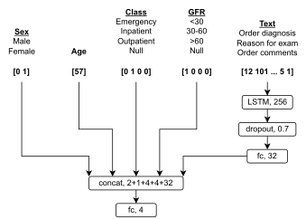

# order-selection-neuro

The goal was to use a combination of structured clinical data and text information (diagnosis codes, reason for exam) from neurologic imaging requests to predict the most appropriate order (modality and use of intravenous contrast). Text information was processed with an LSTM[^1] model using pre-trained BioWordVec[^2] embeddings and concatenated with structured clinical before feeding it into later stages of the model.

The model was trained in two steps:

1. Pre-training the model as a language model using text information (autoregressive sentence completion task)

2. Fine-tuning the model as a classification model using both structured clinical data and text information (assigning one out of 4 possible labels)

***



**Figure 1.** Architecture for the model accepting a combination of structured clinical data and text information.

## Set up environment

```bash
conda create -n <environment-name> python=3.8
conda env update --name <environment-name> --file environment.yml
pip install wandb
```
## Supporting files

- `utils.py` - functions for loading and preparing datasets, saving and loading models, training models
- `metrics.py` - functions for evaluating models
- `model/lstm_lm.py` - model for language model
- `model/lstm_clas_with_meta_simple.py` - model for classification

## Sweep files for `wandb`

The `sweep-lm.yaml` and `sweep-clas-simple.yaml` contain hyperparameter sweep configurations for language model training and classification model training, respectively. More information on how to define your own sweeps can be found in the [Weights & Biases docs](https://docs.wandb.ai/guides/sweeps/define-sweep-configuration).

## Data files

These files must be provided by the user:

- `data/bio_embedding_extrinsic` - pre-trained word embeddings for extrinsic tasks
- `data/misspellings.txt` - replacement rules for out-of-vocabulary terms
- `data/train.csv` - data for training and validation sets
- `data/test.csv` - data for test set

### bio_embedding_extrinsic

Pre-trained BioWordVec[^2] word embeddings can be found at https://github.com/ncbi-nlp/BioWordVec.

### misspellings.txt

The first two lines of the file are reserved for metadata. The number of lines designated for metadata can be changed in the `load_misspelled` function in `utils.py`.

These lines are followed by misspelling replacement rules, which take the form:

```
count misspelled-token -> [replacement-token]* replacement-choice
```

`count` is the number of occurrences of the "misspelled" token in the dataset. *Optional*, but should have some non-whitespace term to work with the code as is.

`misspelled-token` is the "misspelled" token, i.e., it is not found in the BioWordVec vocabulary.

`replacement-token` is a similar or corresponding token in the BioWordVec vocabulary (computed using Levenshtein distance for this paper). There can be any number of these separated by spaces.

`replacement-choice` is either a number starting at `1` indicating the `replacement-token` with which to replace `misspelled-token`, or `#`, which specifies replacing `misspelled-token` with nothing.

An example of this file is provided at `data/misspellings.txt`. Note: This file can have as few or as many replacement rules as needed.

### train.csv

This file should contain the following columns:

- `id` - unique number assigned to this exam
- `sex` - one of `Male` or `Female`
- `age` - integer indicating age in years
- `pt_class` - one of `Emergency`, `Inpatient`, `Outpatient`, or `Null`
- `gfr` - one of `<30`, `30-60`, `>60`, or `Null`
- `text` - text information associated with this imaging request
- `label` - one of `CT HEAD WITHOUT CONTRAST`, `CT HEAD WITH CONTRAST`, `MRI BRAIN WITHOUT CONTRAST`, or `MRI BRAIN WITH CONTRAST`

### test.csv

This file should contain the same columns as `train.csv`.

## Usage

Start a hyperparameter sweep according to the [Weights & Biases docs](https://docs.wandb.ai/guides/sweeps/start-sweep-agents).

### Language model creation

Initiate the sweep agent for the language model:

```bash
wandb sweep sweep-lm.yaml
wandb agent <sweep_id>
```

Once optimal hyperparameters have been determined, these can be entered into `train-lm.py` in the `hyperparameter_defaults` variable. The `train-lm.py` script can then be run once to train the language model and save the weights into the specified `LM_PATH` location.

### Classification model creation

Modify `train-clas.py`  to make `LM_PATH` point to the saved language model weights from the previous step. Then initiate the sweep agent for the classification model to determine the optimal hyperparameters:

```bash
wandb sweep sweep-clas-simple.yaml
wandb agent <sweep_id>
```

## References

[^1]: Hochreiter S, Schmidhuber J. Long Short-Term Memory. *Neural Computation*. 1997;9(8):1735-1780. doi:10.1162/neco.1997.9.8.1735
[^2]: Zhang Y, Chen Q, Yang Z, Lin H, Lu Z. [BioWordVec, improving biomedical word embeddings with subword information and MeSH](https://www.nature.com/articles/s41597-019-0055-0). *Scientific Data*. 2019;6(1):52. doi:10.1038/s41597-019-0055-0